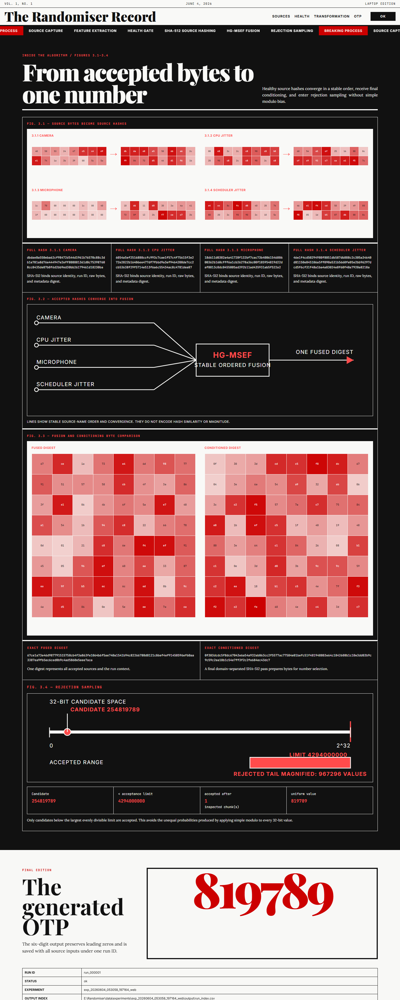
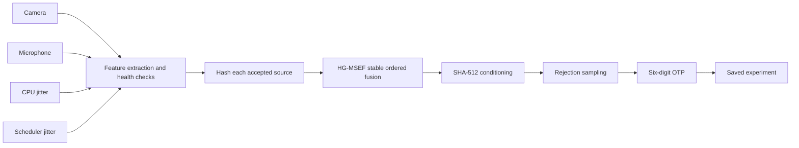

# Randomiser

Randomiser is an experimental Python project that turns noisy laptop signals
into a six-digit OTP.

It collects data from a camera, microphone, CPU timing, and scheduler timing.
Each source is checked before it is allowed into the result. Accepted sources
are hashed separately, fused in a stable order, conditioned with SHA-512, and
converted into a six-digit number with rejection sampling.

The project has two ways to run:

- **Web mode** explains one live run with images, graphs, health checks,
  transformation figures, and the final OTP.
- **Batch mode** runs repeatedly from a terminal and saves every input and
  output for later analysis.

Both modes call the same source collectors, health checks, pipeline, and
storage code.

> [!WARNING]
> Randomiser is a research and portfolio prototype. It is not a certified
> hardware random number generator, true random number generator, or
> production OTP service. Do not use it to protect real accounts, money,
> secrets, or production systems.

## Demo

This screenshot shows a real web run. It follows accepted source bytes through
source hashing, HG-MSEF fusion, SHA-512 conditioning, rejection sampling, and
the final OTP.



The run shown above produced:

```text
experiment: exp_20260604_053058_197164_web
run_id:     run_000001
status:     ok
otp:        819789
```

Its saved output row:

```csv
run_id,mode,camera_input_file,microphone_input_file,cpu_jitter_input_file,scheduler_jitter_input_file,otp,status
run_000001,web,input/camera/run_000001.bin,input/microphone/run_000001.bin,input/cpu_jitter/run_000001.bin,input/scheduler_jitter/run_000001.bin,819789,ok
```

Every run is different. The values above are an example, not an expected test
result.

## The Idea

Laptops already contain several sources of physical and timing variation.
Camera sensor noise, microphone samples, CPU timing differences, and operating
system scheduling delays all change from one moment to the next.

Randomiser records those signals and makes the process inspectable. The web
app is meant for understanding the pipeline. Batch mode is meant for collecting
larger experiment datasets.

The project does not assume that every captured byte is useful. It measures
basic source properties first and excludes failed sources before fusion. These
checks can catch obvious problems, but they do not prove cryptographic entropy.

## Pipeline



### What each step does

1. **Collect sources**

   Read real bytes from the laptop camera, microphone, CPU timing loop, and
   scheduler timing threads.

2. **Extract features**

   Calculate byte diversity, bit balance, Shannon entropy, and
   autocorrelation.

3. **Run the health gate**

   Mark each source as `pass`, `warn`, or `fail`. Failed sources do not enter
   fusion. A run fails when fewer than the configured minimum number of
   sources remain.

4. **Hash accepted sources**

   SHA-512 binds each accepted source to its source name, run ID, raw bytes,
   and metadata digest.

5. **Fuse sources with HG-MSEF**

   Sort source hashes by source name, combine them with the run context, and
   hash the combined payload. Stable ordering keeps the result deterministic
   for the same inputs and context.

6. **Condition the fused bytes**

   Apply a final domain-separated SHA-512 pass before number selection.

7. **Generate the OTP**

   Read 32-bit candidates and use rejection sampling to avoid the bias caused
   by applying a simple modulo operation to every candidate.

8. **Save the run**

   Store source inputs, previews, metadata, status, and OTP under one
   experiment ID.

## Web Mode

Web mode runs one real source collection and reveals each pipeline stage as it
finishes.

It shows:

- the captured camera frame, grayscale conversion, and low-bit map;
- a playable one-second microphone recording and waveform;
- CPU and scheduler timing graphs;
- source health checks, distributions, and lag plots;
- source hashing, fusion, conditioning, and rejection-sampling figures;
- the generated OTP and saved experiment paths.

Start it from the project root:

```powershell
python scripts/run_web.py
```

Then open:

```text
http://localhost:4173
```

The browser page is served by Node.js. The source collection and OTP pipeline
run in Python.

## Batch Mode

Batch mode repeatedly runs the same pipeline without the browser interface.
It is useful when collecting a larger set of inputs and OTP results.

Run the configured batch:

```powershell
python scripts/generate_dataset.py --config config/batch_run.yaml
```

Override the configured run count:

```powershell
python scripts/generate_dataset.py --config config/batch_run.yaml --runs 100
```

Generate one terminal run:

```powershell
python scripts/run_once.py --config config/laptop_mvp.yaml
```

Check the four real sources before a longer run:

```powershell
python scripts/calibrate_sources.py --config config/laptop_mvp.yaml
```

## Installation

### Requirements

- Python 3.11 or newer
- Node.js
- A working camera and microphone
- Operating-system permission to use the camera and microphone

### Setup

```powershell
git clone https://github.com/brinesolution/Randomizer.git
cd Randomizer
python -m venv .venv
.\.venv\Scripts\Activate.ps1
python -m pip install --upgrade pip
python -m pip install -e .
```

Run the test suite:

```powershell
pytest -q
```

## Saved Experiments

Both run modes save data under `data/experiments/`.

```text
data/experiments/<experiment_id>/
  manifest.json
  input/
    camera/<run_id>.bin
    microphone/<run_id>.bin
    cpu_jitter/<run_id>.bin
    scheduler_jitter/<run_id>.bin
  output/
    previews/
      camera/
      microphone/
    run_index.csv
  logs/
```

All source files from one run share the same `run_id`. The corresponding CSV
row records those file paths beside the OTP, run status, mode, and timestamp.

Camera and microphone previews are saved by web mode so the visual report can
be inspected after a run finishes.

> [!CAUTION]
> Experiment folders can contain private camera frames, microphone recordings,
> and device timing data. Review them before sharing or committing them.

## Project Layout

```text
apps/web/                 Node server and browser interface
config/                   Source and run-mode configuration
docs/                     Architecture, algorithm, and limitation notes
scripts/                  Commands for web, batch, calibration, and one run
src/randomiser/core/      Shared models, configuration, hashing, and utilities
src/randomiser/sources/   Camera, microphone, CPU, and scheduler collectors
src/randomiser/pipeline/  Health checks, fusion, conditioning, and OTP logic
src/randomiser/io/        Experiment folders, raw inputs, manifests, and CSVs
src/randomiser/modes/     Batch and web backend entry points
src/randomiser/trace/     Display-ready pipeline and visualization data
tests/                    Unit and integration tests
```

## Configuration

Useful starting configurations:

- `config/laptop_mvp.yaml`: one laptop run with all four sources.
- `config/web_mode.yaml`: web-mode source and storage settings.
- `config/batch_run.yaml`: long-running batch settings.
- `config/degraded_mode.yaml`: exercises reduced-source behavior.

The default web and batch configurations require at least two healthy sources.

## Further Reading

- [Project overview](docs/project_overview.md)
- [Architecture](docs/architecture.md)
- [HG-MSEF fusion](docs/algorithm_hg_msef.md)
- [Entropy sources](docs/entropy_sources.md)
- [Source health tests](docs/source_health_tests.md)
- [OTP generation](docs/otp_generation.md)
- [Dataset schema](docs/dataset_schema.md)
- [Limitations](docs/limitations.md)

## Current Scope

Randomiser is useful for controlled experiments, demonstrations, and learning
how a multi-source entropy pipeline can be structured and inspected.

The current health checks are intentionally broad. They can reject obvious
failures, but they are not a substitute for formal entropy estimation,
statistical certification, hardware validation, or an external security audit.
