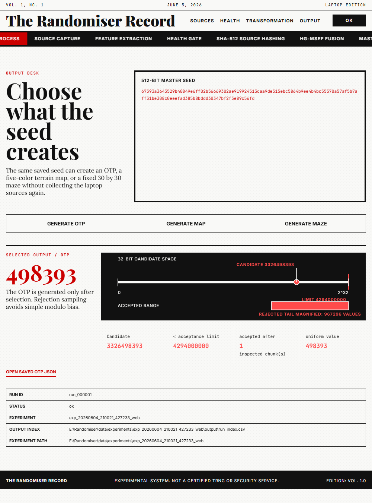
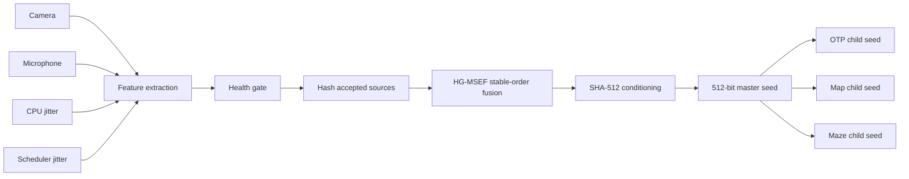

# Randomiser

Randomiser collects small variations already present on a laptop and turns
them into a reusable 512-bit seed. The seed can then produce an OTP, a terrain
map, or a maze without collecting the sources again.

The project has two useful sides:

- a live web report for seeing what happens during one run;
- a terminal batch mode for collecting many runs into structured experiment
  folders.

The camera, microphone, CPU timing loop, and scheduler timing threads all use
real laptop hardware or operating-system behavior. Every source is measured
before it can enter the seed.

> [!WARNING]
> Randomiser is not a certified hardware random number generator, true random
> number generator, or security service. Do not use it to protect real
> accounts, money, production systems, or secrets.

## Results

One saved seed can create all three outputs. Each output receives its own
domain-separated child seed, so generating one does not consume or alter the
others.

<table>
  <tr>
    <th width="33%">Six-digit OTP</th>
    <th width="33%">Five-color terrain map</th>
    <th width="33%">30 x 30 perfect maze</th>
  </tr>
  <tr>
    <td></td>
    <td></td>
    <td></td>
  </tr>
  <tr>
    <td>Leading zeros are preserved. Rejection sampling avoids simple modulo bias.</td>
    <td>Deep ocean, shallow ocean, beach, land, and highland form a deterministic 48 x 48 grid.</td>
    <td>The maze is connected, has one route between any two cells, and keeps every outside wall closed.</td>
  </tr>
</table>

## How one run works



1. The four collectors run in parallel and return byte streams with metadata.
2. Randomiser measures each source and rejects obvious failures.
3. Each accepted source is hashed independently with its identity and run
   context.
4. HG-MSEF sorts the source hashes by source name and fuses them with SHA-512.
5. A separate SHA-512 conditioning pass produces the 64-byte master seed.
6. The user chooses an output. Randomiser derives an isolated child seed for
   that output and saves the result as JSON.

The source pipeline stops at the master seed. OTP generation is not part of
seed creation.

## Source collection

| Source | What is collected | Bytes passed to the pipeline |
| --- | --- | --- |
| Camera | One OpenCV frame | Frame channels are averaged to grayscale, then the lowest two bits of each pixel are packed into bytes. |
| Microphone | Signed 16-bit audio samples | Adjacent sample deltas are calculated, then their lowest two bits are packed into bytes. |
| CPU jitter | `perf_counter_ns()` timing differences around a small CPU loop | The low byte of each timing delta. |
| Scheduler jitter | Timing differences from threads repeatedly yielding with `sleep(0)` | The low byte of each scheduling delta. |

The full camera frame and microphone recording are retained for the web
report. The experiment input folders store the exact byte streams used by the
pipeline.

## Health gate

Randomiser calculates byte count, unique-byte count, bit balance, Shannon
entropy, and lag-1 autocorrelation for each source. The current gate rejects a
source when any of these checks fail:

| Check | Current requirement |
| --- | --- |
| Non-empty | At least one byte |
| Non-constant | More than one distinct byte |
| Byte diversity | At least 4 distinct byte values |
| Bit balance | Between `0.20` and `0.80` |
| Shannon entropy estimate | At least `1.0` bits per byte |

Autocorrelation is recorded and displayed but is not currently a pass/fail
threshold. The default laptop configuration needs at least two healthy
sources. A run with too few healthy sources produces no seed.

These checks catch obvious collection problems. They do not prove
cryptographic entropy.

## Seed construction

Randomiser uses separate domain labels for source hashing, fusion,
conditioning, and output derivation.

```text
source bytes + source name + run ID + metadata digest
    -> randomiser.source_hash.v1

stable ordered source hashes + run context
    -> randomiser.hg_msef.v1

fused digest + run context
    -> randomiser.conditioner.v1
    -> 512-bit master seed

master seed + output namespace
    -> randomiser.output.v1
    -> isolated OTP, map, or maze child seed
```

The source-name ordering makes fusion reproducible for the same source hashes
and run context. Domain separation prevents a child seed intended for one
output type from being reused by another.

## Output algorithms

### OTP

The OTP generator reads 32-bit candidates from the OTP child seed. Candidates
outside the largest evenly divisible range are rejected before the accepted
value is reduced to six digits. The saved JSON includes the selected
candidate, acceptance limit, inspected count, final value, and child-seed
hash.

### Terrain map

The map generator expands the map child seed into a 48 x 48 byte field,
smooths the field over six rounds, and divides the elevation values into five
quantile-based terrain categories:

| Index | Terrain | Color |
| ---: | --- | --- |
| 0 | Deep ocean | `#075985` |
| 1 | Shallow ocean | `#38bdf8` |
| 2 | Beach | `#e7d3a1` |
| 3 | Land | `#65a30d` |
| 4 | Highland | `#166534` |

### Maze

The maze generator uses deterministic randomized depth-first search over a
fixed 30 x 30 grid. Every cell begins with four walls. The generator removes
walls while visiting unvisited neighbors, leaving a connected perfect maze
with `899` passages and a closed outside boundary.

The start cell is the top-left corner and the end cell is the bottom-right
corner.

## Run it locally

Requirements:

- Python 3.11 or newer
- Node.js
- a working camera and microphone
- operating-system permission to access those devices

```powershell
git clone https://github.com/brinesolution/Randomizer.git
cd Randomizer
python -m venv .venv
.\.venv\Scripts\Activate.ps1
python -m pip install --upgrade pip
python -m pip install -e .
```

Check the four sources before starting:

```powershell
python scripts/calibrate_sources.py --config config/laptop_mvp.yaml
```

Start the web report:

```powershell
python scripts/run_web.py
```

Open `http://localhost:4173` and press **Start live source run**.

## Terminal and batch usage

Generate and save one seed:

```powershell
python scripts/run_once.py --config config/laptop_mvp.yaml
```

Generate one seed and save a selected output:

```powershell
python scripts/run_once.py --config config/laptop_mvp.yaml --output-kind otp
python scripts/run_once.py --config config/laptop_mvp.yaml --output-kind map
python scripts/run_once.py --config config/laptop_mvp.yaml --output-kind maze
```

Run a larger experiment:

```powershell
python scripts/generate_dataset.py --config config/batch_run.yaml --runs 10000
```

Generate one maze for every saved batch seed:

```powershell
python scripts/generate_dataset.py --config config/batch_run.yaml --runs 10000 --output-kind maze
```

Inspect a saved experiment:

```powershell
python -m randomiser inspect-experiment data/experiments/<experiment_id>
```

## Web API

The Node.js server exposes a small local API backed by the Python pipeline.

| Method | Endpoint | Purpose |
| --- | --- | --- |
| `GET` | `/api/health` | Check whether the local web server is running. |
| `GET` | `/api/run-stream` | Run the source pipeline and stream completed stages as server-sent events. |
| `POST` | `/api/run` | Run the source pipeline and return one completed seed report. |
| `POST` | `/api/generate` | Generate and save one selected output from an existing saved seed. |
| `GET` | `/artifacts/<experiment_id>/...` | Read a saved experiment artifact. |

Example output request:

```json
{
  "kind": "map",
  "seed": "<128-character hexadecimal seed>",
  "experimentId": "exp_...",
  "runId": "run_000001"
}
```

The generation endpoint verifies that the experiment and run exist and that
the supplied seed matches the saved `run_index.csv` row.

## Saved experiments

```text
data/experiments/<experiment_id>/
  manifest.json
  input/
    camera/<run_id>.bin
    microphone/<run_id>.bin
    cpu_jitter/<run_id>.bin
    scheduler_jitter/<run_id>.bin
  output/
    previews/
      camera/
      microphone/
    generated/
      otp/<run_id>.json
      map/<run_id>.json
      maze/<run_id>.json
    run_index.csv
  logs/
```

`run_index.csv` connects the four source input filenames, master seed, run
status, mode, and timestamp. All files created by one run share the same
`run_id`.

> [!CAUTION]
> Experiment folders can contain private camera frames, microphone recordings,
> and device timing data. Review them before sharing or committing them.

## Project structure

```text
apps/web/                   Node server and browser interface
config/                     Source and run-mode configuration
docs/                       Architecture, algorithm, and schema notes
scripts/                    Web, batch, calibration, and one-run commands
src/randomiser/core/        Shared models, configuration, paths, and hashing
src/randomiser/integrations Hardware adapters for camera and microphone
src/randomiser/sources/     Source collection and byte transformation
src/randomiser/pipeline/    Health gate, source hashing, fusion, and conditioning
src/randomiser/generators/  OTP, terrain-map, and maze generation
src/randomiser/io/          Experiment and generated-output storage
src/randomiser/modes/       Batch and web backend workflows
src/randomiser/trace/       Display-ready pipeline visualization data
tests/                      Unit and integration tests
```

`EntropyManager` owns source collection through master-seed creation.
Generators only accept a saved seed. This boundary keeps collection,
validation, and procedural generation independently testable.

## Tests

```powershell
pytest -q
```

The suite covers source transformations, feature extraction, health checks,
fusion and conditioning, storage contracts, CLI behavior, deterministic
output generation, map palette limits, maze connectivity, and closed maze
boundaries. Integration tests also exercise the real laptop sources.

## Limitations

- Source quality depends on the laptop, drivers, operating-system scheduling,
  environment, and current system load.
- The health gate detects broad failures but does not estimate min-entropy or
  provide formal statistical certification.
- SHA-512 conditions the collected bytes; it cannot create entropy that was
  not present in the inputs.
- Maps and mazes are deterministic demonstrations, not simulation-grade
  procedural generation.
- The project has not received an external cryptographic or security audit.

More detail is available in [docs/limitations.md](docs/limitations.md).

## Documentation

- [Architecture](docs/architecture.md)
- [HG-MSEF fusion](docs/algorithm_hg_msef.md)
- [Entropy sources](docs/entropy_sources.md)
- [Source health tests](docs/source_health_tests.md)
- [OTP generation](docs/otp_generation.md)
- [Dataset schema](docs/dataset_schema.md)

## License

Randomiser is licensed under the [Apache License 2.0](LICENSE).
