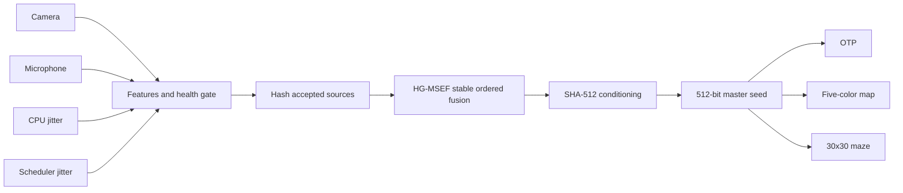

# Randomiser

Randomiser is a Python and Node.js application that turns noisy laptop signals
into a reusable 512-bit seed.

It collects data from a camera, microphone, CPU timing loop, and scheduler
timing threads. Each source is measured before it is accepted. Healthy sources
are hashed separately, fused in a stable order, and conditioned with SHA-512.

After the seed is saved, the user chooses what it creates:

- a six-digit OTP generated with rejection sampling;
- a five-color terrain map;
- a fixed 30 by 30 perfect maze with a closed outer boundary.

The source pipeline runs once. All selected outputs are deterministic
derivations of that same seed.

> [!WARNING]
> Randomiser is not a certified hardware random number generator, true random
> number generator, or security service. Do not use it to protect real
> accounts, money, or secrets.

## Demo

The web report explains the live source process, stops at the master seed, and
then offers OTP, map, and maze output controls.


## Pipeline



### Seed creation

1. Collect real bytes from the four laptop sources.
2. Calculate byte diversity, bit balance, Shannon entropy, and
   autocorrelation.
3. Mark each source as `pass`, `warn`, or `fail`.
4. Hash each accepted source with its identity, run ID, bytes, and metadata.
5. Fuse accepted hashes in stable source-name order with the run context.
6. Apply final SHA-512 conditioning and save the resulting 512-bit seed.

### Output generation

Each output receives its own domain-separated child seed. Generating a map does
not consume or change the seed used for an OTP or maze.

- **OTP:** six digits with leading zeros preserved. Rejection sampling avoids
  simple modulo bias.
- **Map:** a deterministic 48 by 48 terrain grid using deep ocean, shallow
  ocean, beach, land, and highland.
- **Maze:** a deterministic perfect maze with exactly 30 by 30 cells, closed
  outside walls, and opposite-corner start and end cells.

## Web mode

Web mode reveals each source and seed-creation stage as the backend completes
it. Afterward, the same seed can generate any of the three outputs without
collecting the laptop sources again.

```powershell
python scripts/run_web.py
```

Open `http://localhost:4173`.

The browser interface is served by Node.js. Source collection, seed creation,
output generation, and storage run in Python.

## Terminal and batch modes

Generate and save one seed:

```powershell
python scripts/run_once.py --config config/laptop_mvp.yaml
```

Generate one seed and a selected output:

```powershell
python scripts/run_once.py --config config/laptop_mvp.yaml --output-kind map
```

Generate many seeds:

```powershell
python scripts/generate_dataset.py --config config/batch_run.yaml --runs 100
```

Generate a maze for every batch seed:

```powershell
python scripts/generate_dataset.py --config config/batch_run.yaml --runs 100 --output-kind maze
```

Check the real source devices before a longer run:

```powershell
python scripts/calibrate_sources.py --config config/laptop_mvp.yaml
```

## Installation

Requirements:

- Python 3.11 or newer
- Node.js
- A working camera and microphone
- Operating-system permission to access those devices

```powershell
git clone https://github.com/brinesolution/Randomizer.git
cd Randomizer
python -m venv .venv
.\.venv\Scripts\Activate.ps1
python -m pip install --upgrade pip
python -m pip install -e .
pytest -q
```

## Saved experiments

```text
data/experiments/<experiment_id>/
  manifest.json
  input/
    camera/<run_id>.bin
    microphone/<run_id>.bin
    cpu_jitter/<run_id>.bin
    scheduler_jitter/<run_id>.bin
  output/
    previews/
      camera/
      microphone/
    generated/
      otp/<run_id>.json
      map/<run_id>.json
      maze/<run_id>.json
    run_index.csv
  logs/
```

`run_index.csv` ties every source input to the saved master seed and run
status. Selected outputs are stored separately under the same run ID.

> [!CAUTION]
> Experiment folders can contain private camera frames, microphone recordings,
> and device timing data. Review them before sharing or committing them.

## Project layout

```text
apps/web/                   Node server and browser interface
config/                     Source and run-mode configuration
docs/                       Architecture and algorithm notes
scripts/                    Web, batch, calibration, and one-run commands
src/randomiser/core/        Shared models, configuration, and hashing
src/randomiser/sources/     Laptop source collectors
src/randomiser/pipeline/    Health checks, fusion, and seed creation
src/randomiser/generators/  OTP, terrain map, and maze generators
src/randomiser/io/          Experiment and generated-output storage
src/randomiser/modes/       Batch and web backend workflows
src/randomiser/trace/       Display-ready pipeline visualization data
tests/                      Unit and integration tests
```

## Design notes

- The entropy pipeline owns seed creation only.
- Output generators never recollect sources or repeat the health gate.
- Child seeds are domain separated by output kind.
- A failed health gate produces no seed and disables output generation.
- The map palette is intentionally limited to five colors.
- The maze dimensions and outside boundary are fixed by contract.

## Further reading

- [Project overview](docs/project_overview.md)
- [Architecture](docs/architecture.md)
- [HG-MSEF fusion](docs/algorithm_hg_msef.md)
- [Entropy sources](docs/entropy_sources.md)
- [Source health tests](docs/source_health_tests.md)
- [OTP generation](docs/otp_generation.md)
- [Dataset schema](docs/dataset_schema.md)
- [Limitations](docs/limitations.md)

## License

Randomiser is licensed under the [Apache License 2.0](LICENSE).
